# Results Log

## 30/07

### 1

Results:

- country: us
- investments: vc early (left) and late stage (right) - bipartite
- early: ['angel', 'pre_seed', 'seed', 'series_a']
late: ['series_b', 'series_c', 'series_d', 'series_e', 'series_f', 'series_g', 'series_h', 'series_i', 'series_unknown']
filter: top 30% most connected vcs
- min_year: 2005
- max_year: 2023
- note: to make bipartite, suffixes with investment_series are added

- static:
  - Bipartite matrix shape: (2744, 3277)
  - Number of connections: 110842
  - Matrix density: 0.0123
  - Nestedness (NODF): 0.0444

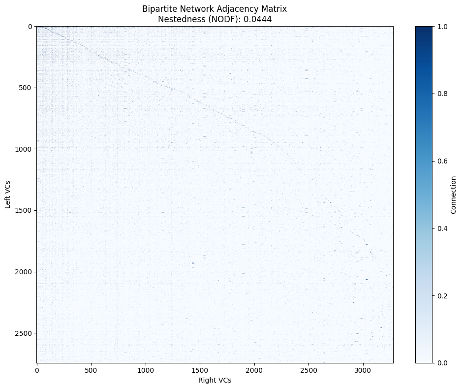

- time series cumulative:
  - window: 5 years
  - swap_method: curve ball
  - swap_its: 50000
  - num_null_models: 500

  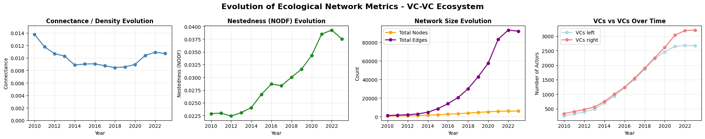
  
  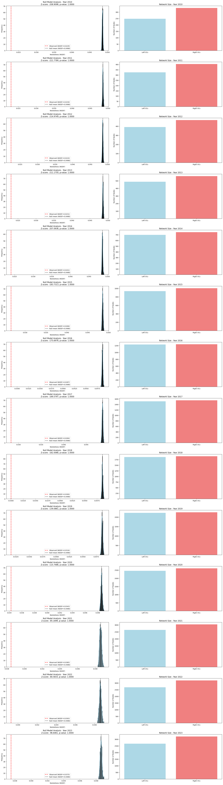

### 2

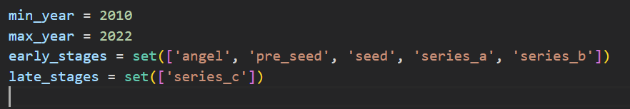
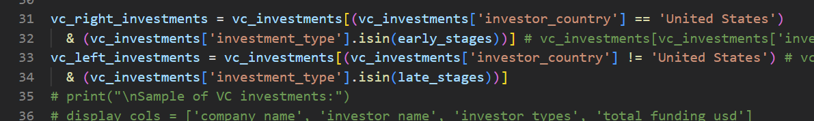

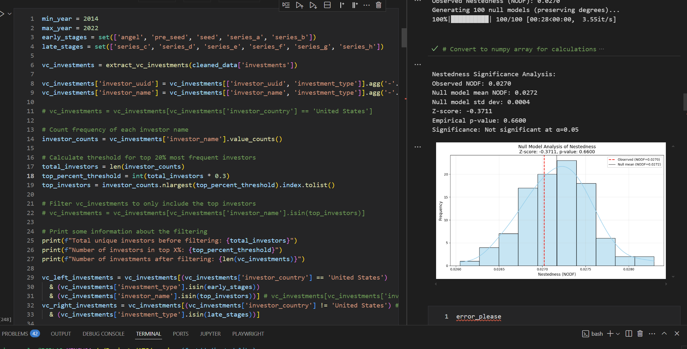
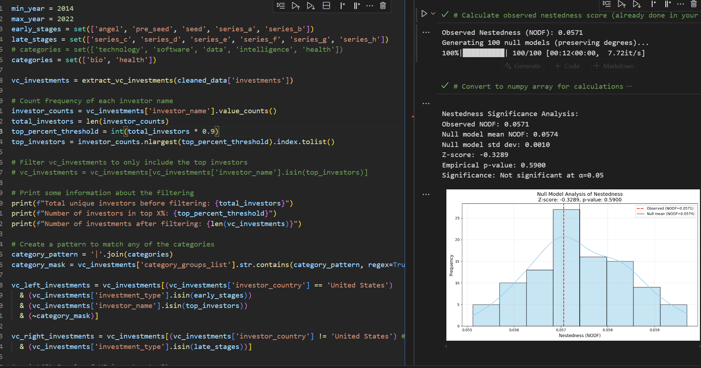

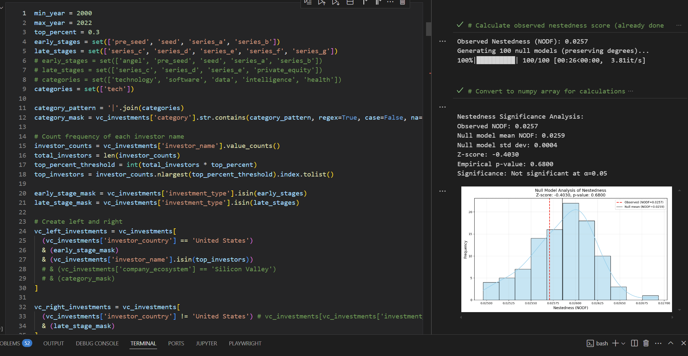
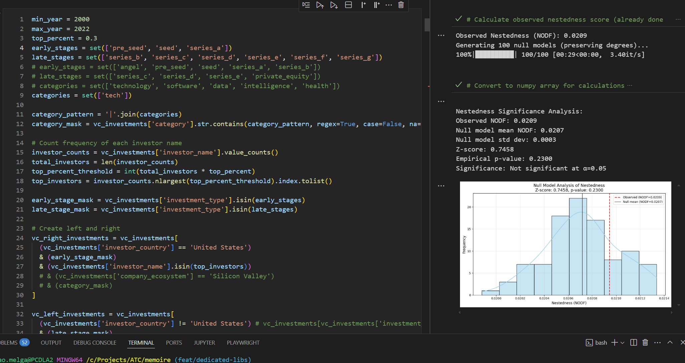
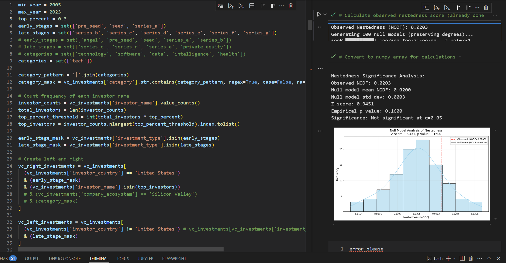
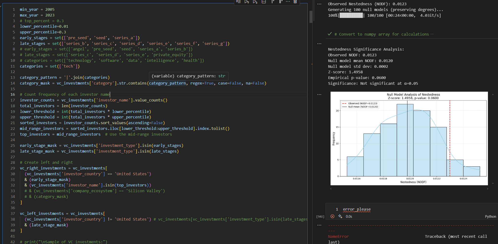
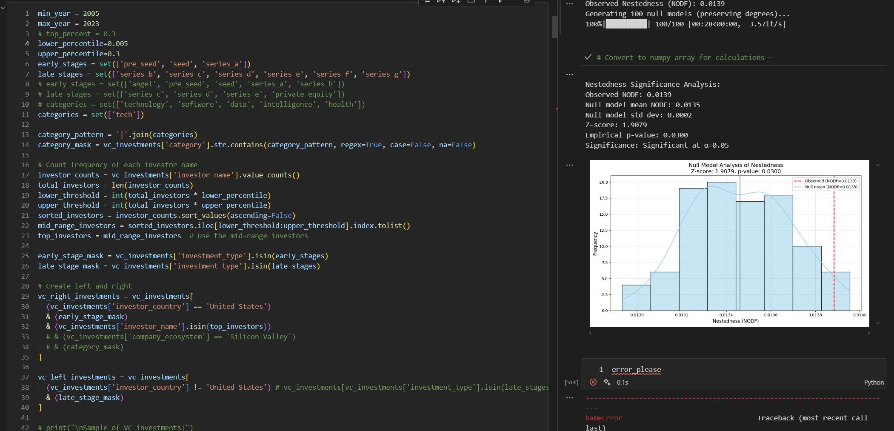
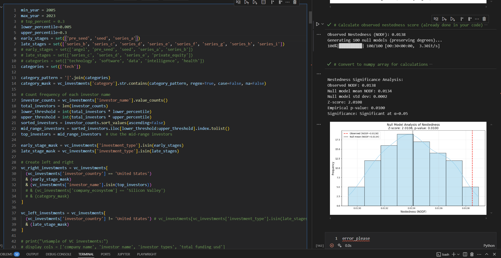
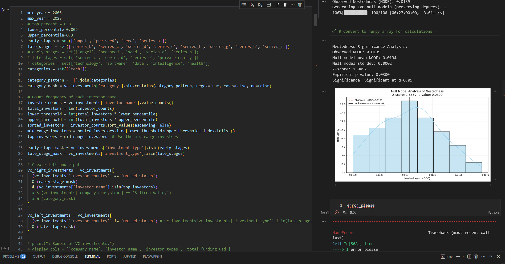
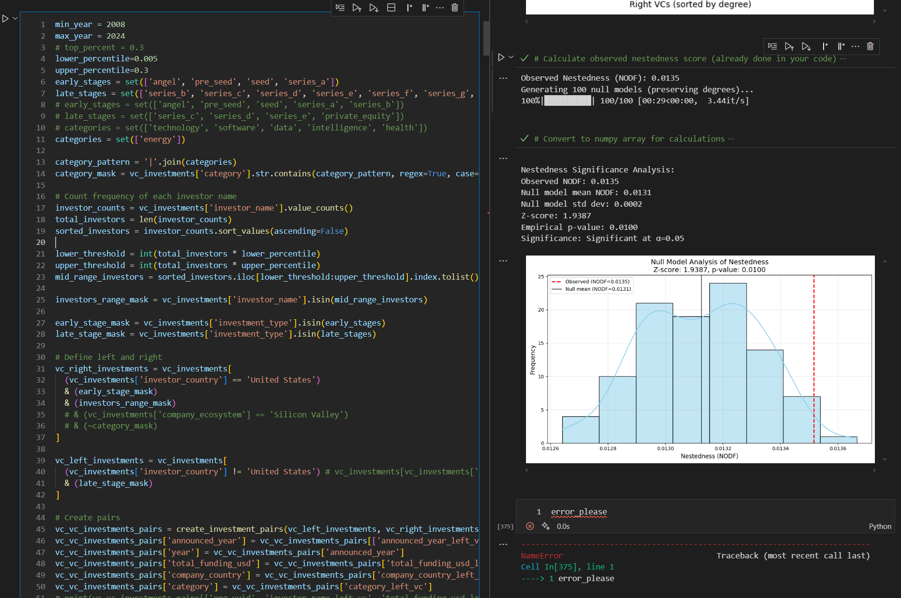
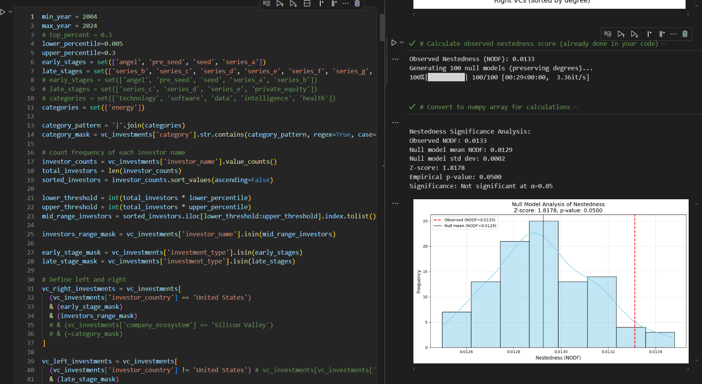